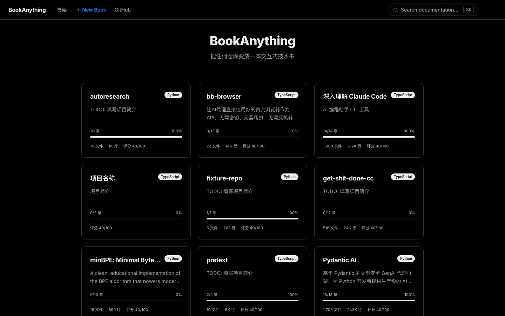
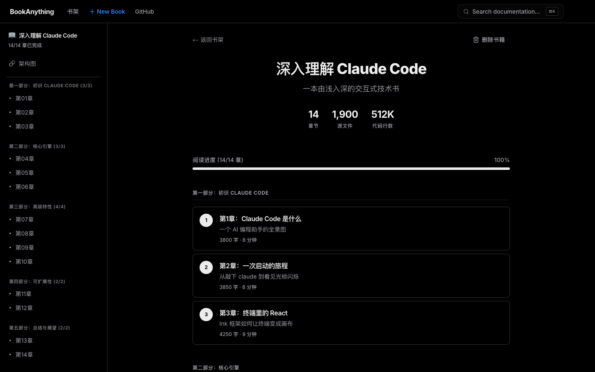

# BookAnything

把任意源码仓库「讲成一本由浅入深的技术书」，并用 **Next.js 交互站点** 阅读。  
编排引擎是 **pyharness**（Plan → Write → Eval 循环），章节与图谱数据落在 `knowledge/`。

## 路线图

BookAnything 将任意仓库变成可交互阅读的「技术书」；产品演进按阶段推进。**任务表、架构示意、里程碑与技术决策**以仓库内 [ROADMAP.md](ROADMAP.md) 为准（以下为阶段速览，便于在首页一眼看到方向）。

| 阶段 | 主题 | 要事 |
|------|------|------|
| **Phase 0** | 基础加固 | 多书知识库结构、`knowledge/index.json`、章节 JSON 校验、评分校准 |
| **Phase 1** | 动态 Web 化 | 动态站 + API、书架 `/books`、章节运行时加载 |
| **Phase 2** | 书籍管理 | 网页创建书、章节目录编辑、单章重写、删除与批量操作 |
| **Phase 3** | 实时写书引擎 | Job 队列、SSE 进度、Dashboard、交互式暂停 / 跳过 |
| **Phase 4** | 智能增强 | AutoResearch、智能规划 v2、跨章一致性、AI 编辑与多语言等 |
| **Phase 5** | 平台化 | 认证、Git 集成、公开书架、导出、对外开放 API |

→ **完整路线图：[ROADMAP.md](ROADMAP.md)**

## 页面截图

### 书架 `/books`



### 阅读页 `/books/claude-code`（示例书目）



## 阅读站里都能做什么

不止「看书」：站点围绕 `knowledge/<bookId>/` 里的章节 JSON、大纲与图谱数据，把目录、检索、覆盖度与源码结构连在一起。

| 能力 | 路径 / 入口 | 说明 |
|------|----------------|------|
| 书架 | `/books` | 多本书的入口列表 |
| 章节正文 | `/books/<bookId>/chapters/<章节 id>` | 交互式阅读已写入的章节 |
| 搜索 | `/books/<bookId>/search` | 全书检索（基于章节与模块索引） |
| 仪表盘 | `/books/<bookId>/dashboard` | 成书与覆盖度等统计视图 |
| **知识图谱** | `/books/<bookId>/explore` | 读取 `knowledge-graph.json`（React Flow）。支持文件 / 模块视图切换、按分层筛选（如 api、service、data 等）、节点搜索、按「已覆盖 / 未覆盖」过滤；覆盖状态与 `chapter-outline.json` 中的大纲对齐。若尚无图谱，会检查目标仓库是否存在，并可通过 **Analyze**（`POST /api/books/<bookId>/analyze`）在后台生成，期间展示实时进度 |
| **架构图（弹窗）** | 侧栏「架构图」 | 打开 `GraphModal`，经 `graph-data` 汇总模块依赖与架构分层，D3 绘制依赖图，便于总览（与 explore 的细粒度知识图谱互补） |

**数据落盘**：分析结束后，`knowledge/<bookId>/knowledge-graph.json` 供 explore 使用；`chapter-outline.json`（若存在）用于标注节点是否已被某章覆盖。可用 `pyharness analyze --project ...` 或在站点里触发分析任务来生成或更新这些文件。

## 快速开始

### 阅读站（Web）

```bash
cd web-app
npm install
npm run dev
```

浏览器打开 <http://localhost:3000> → 默认会进入书架。站点从仓库根目录下的 `knowledge/` 与 `projects/` 读取数据。

### 编排 CLI（Python）

```bash
python3 -m venv .venv
source .venv/bin/activate  # Windows: .venv\Scripts\activate
pip install -e ".[dev]"

pyharness run --project projects/claude-code.yaml
pyharness init /path/to/target-repo
pyharness write --project projects/your-book.yaml --chapter ch01-overview
pyharness analyze --project projects/your-book.yaml
```

常用参数见 `pyharness/__main__.py`（如 `--max-hours`、`--threshold`、`--quick` 等）。

## 仓库结构（概要）

| 路径 | 作用 |
|------|------|
| `pyharness/` | Python 编排：跑循环、初始化项目配置、单章写作、源码分析 |
| `web-app/` | Next.js 站点：目录、搜索、仪表盘、知识图谱等 |
| `projects/*.yaml` | 每本书的目标仓库、章节列表与元数据 |
| `knowledge/<书名>/` | 生成的章节 JSON、索引、图谱等 |
| `.claude/` | 写书与评测用到的规则与技能 |

## 许可证

以仓库内 LICENSE 文件为准（若尚未添加，请先补充）。
